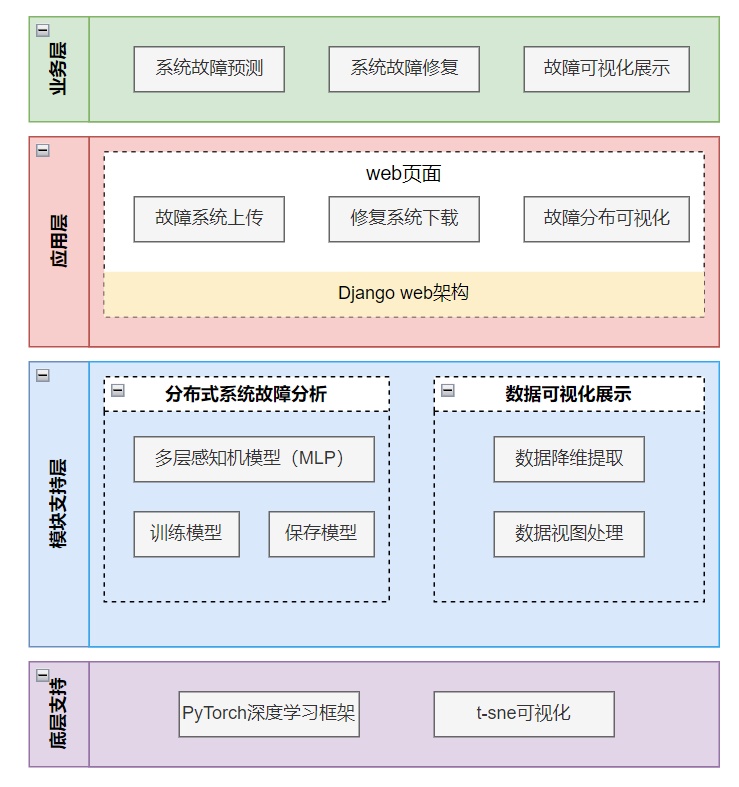

# 基于机器学习的分布式系统故障诊断系统 - 架构文档

## 一、简介

本文档的目的是详细地介绍基于机器学习的分布式系统故障诊断系统所包含的需求。基于机器学习的分布式系统故障诊断系统是一个利用机器学习和深度学习技术对分布式系统的故障数据进行分析的工具，旨在帮助用户准确地识别和分类分布式系统中的故障，并实现分布式系统故障运维的智能化。为了确保客户能够明确了解产品的具体需求，并使开发人员能够根据这些需求进行设计和编码，我们将在以下部分描述基于机器学习的分布式系统故障诊断系统的功能、性能、用户界面、运行环境和外部接口。此外，我们还将详细说明针对用户操作的各种系统响应。

## 二、分布式故障诊断系统方案

### 2.1 需求介绍

该项目是为满足分布式系统故障高效、准确诊断的需求而开发的。基于机器学习的分布式系统故障诊断系统不仅可以对分布式系统的故障数据进行深入的分析，还可以设计出准确的故障诊断模型。此外，它还为分布式系统故障的智能化运维提供了有效的技术支持。通过本系统，用户可以实现对分布式系统故障的快速检测和恢复，从而降低运维难度，减少人力资源消耗。

### 2.2 需求分析

#### 2.2.1 一般性需求

- **操作系统适配性**：系统应能够适配主流的操作系统，如Windows、Linux等。
- **性能和可靠性**：系统需保证高性能运行，同时确保在各种故障情况下的可靠性。
- **可维护性**：系统应当有良好的文档和代码结构，确保后期可以轻松地进行维护和升级。
- **可扩充性**：随着业务的增长和技术的更新，系统应具有良好的可扩充性，以满足未来的需求。
- **适应性**：系统需能够适应不同的技术和业务场景，以确保其在多种环境下都能够稳定运行。

##### 2.2.2 功能性需求

##### 2.2.2.1 用户需求

###### 1 基于机器学习的故障诊断功能

- **故障诊断与分类**：用户需要系统能够准确地诊断和分类分布式系统中的故障。
- **KPI指标监控**：用户希望在所有节点正常运行时，所有KPI指标都在正常范围内。
- **故障检测**：用户希望系统能够检测到节点的故障，并识别导致KPI指标异常的故障。
- **故障传播识别**：用户希望系统能够识别故障在分布式系统中的传播情况。
- **在线模型训练与测试**：用户希望能够在线上传训练数据、训练模型，并上传测试数据进行故障诊断测试。
- **测试结果处理**：用户希望能够可视化和下载测试结果。

###### 2 WEB平台功能

- **数据上传界面**：用户需要一个界面来上传训练数据和测试数据。
- **在线模型训练与测试**：用户希望在线进行模型的训练和测试。
- **模型下载**：用户希望WEB平台能够提供模型下载功能。
- **测试结果处理**：用户希望WEB平台能够支持测试结果的可视化和下载。
- **异常处理**：用户希望WEB平台能够处理网络连接问题、数据格式问题和模型训练失败等问题。

###### 3 用户下载模型与训练结果功能

- **模型与结果下载**：用户希望下载训练的模型和结果以便于离线使用或进一步分析。
- **训练结果摘要查看**：用户希望在下载前能够查看训练结果的摘要。

###### 4 可视化分类结果功能

- **分类结果可视化**：用户希望通过图形化的方式更直观地查看分类结果。
- **可视化方式选择**：用户希望可以选择不同的可视化方式，如柱状图、饼图、散点图等。
- **详细查看**：用户希望可以放大、缩小或滚动查看详细的可视化结果。

##### 2.2.2.2 系统需求

###### 1 基于机器学习的故障诊断功能（SystemHealer-SR1）

1. **初始假设：**
   - 分布式系统中存在多个节点。
   - 每个节点有一系列的KPI指标，如feature0、feature1 ...feature106。
   - 故障会导致某些KPI指标异常。
2. **正常状态：**
   - 分布式系统的所有节点正常运行。
   - 所有KPI指标在正常范围内。
3. **有哪些会出错：**
   - 节点可能会发生故障。
   - 故障会导致相关的KPI指标异常。
   - 故障可能会沿着分布式系统的拓扑结构传播。
4. **其他活动：**
   - 用户可以上传训练数据并在线训练模型。
   - 用户可以上传单条或多条测试语句进行测试。
   - 系统支持可视化测试结果和下载测试结果。
5. **完成的系统状态：**
   - 故障被准确地诊断并分类。
   - 分布式系统恢复到正常状态。

###### 2 WEB平台功能（SystemHealer-SR2）

1. **初始假设：**
   - 用户需要一个界面来上传训练数据和测试数据。
   - 用户希望在线进行模型的训练和测试。
2. **正常状态：**
   - WEB平台正常运行。
   - 用户可以顺利上传、训练和测试。
3. **有哪些会出错：**
   - 网络连接问题。
   - 用户上传的数据格式不正确。
   - 模型训练失败。
4. **其他活动：**
   - WEB平台提供模型下载功能。
   - WEB平台支持测试结果的可视化和下载。
5. **完成的系统状态：**
   - 用户成功完成模型的训练和测试。
   - 用户可以下载训练的模型和测试结果。

###### 3 用户下载模型与训练结果功能（SystemHealer-SR-TS3）

1. **初始假设：**
   - 用户已经完成了模型的在线训练。
   - 用户希望下载训练的模型和结果以便于离线使用或进一步分析。
2. **正常状态：**
   - WEB平台提供了下载模型和训练结果的功能。
   - 用户可以轻松找到并点击下载按钮。
3. **有哪些会出错：**
   - 网络连接问题导致下载中断。
   - 服务器存储问题导致模型或结果丢失。
   - 用户下载过程中出现未知错误。
4. **其他活动：**
   - 用户可以查看训练结果的摘要，然后决定是否下载完整结果。
5. **完成的系统状态：**
   - 用户成功下载了训练的模型和结果。
   - 用户可以在本地使用或分析这些文件。

###### 4 可视化分类结果功能（SystemHealer-SR-TS4）

1. **初始假设：**
   - 用户已经上传了测试数据并得到了分类结果。
   - 用户希望通过图形化的方式更直观地查看分类结果。
2. **正常状态：**
   - WEB平台提供了分类结果的可视化功能。
   - 分类结果以图表、图形或其他形式清晰展示。
3. **有哪些会出错：**
   - 数据太大导致可视化加载缓慢。
   - 未知的数据格式导致可视化失败。
   - 用户界面出现显示错误。
4. **其他活动：**
   - 用户可以选择不同的可视化方式（如柱状图、饼图、散点图等）。
   - 用户可以放大、缩小或滚动查看详细的可视化结果。
5. **完成的系统状态：**
   - 用户成功查看了分类结果的可视化。
   - 用户对分类结果有了更深入的理解。

### 2.3 复杂度分析

### 2.4 用例图

### 2.5 质量场景

## 三、架构设计

### 3.1 样式选择，参考模型，参考架构

### 3.2 体系结构的设计

### 3.3 系统架构的分析与设计

### 3.4 架构演进规划

### 3.5 小结

